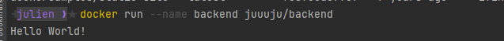

# TP1  Docker - Devops
## Contenue du tp
Mon tp contient les parties suivantes :
- Database
- Backend API
- Http server
- Link application

Je n'ai pas pu finir la partie publish et la partie Docker-compose n'est pas terminée non plus.

Le tp est donc divisé en 4 parties. Tout est contenue dans ce dossier, la partie database dans le dossier ./database, la partie backend dans le dossier ./backend, la partie http server dans le dossier ./httpserver et la partie docker compose dans le fichier ./docker-compose.yml .

## Database
Le contenu du Dockerfile est donné dans le sujet du tp. Pour construire une image et lancer le container proprement, voici les commandes à lancer en étant dans le dossier ./database:

``` 
# Commande pour construire l'image du container
docker build -t juuuju/database .

# Commande pour lancer le container avec le nom "database", en mode "detached" et sur le port "8090"
docker run -d -p 8090:5000 --name database juuuju/database

# Commande pour lancer l'adminer sur le port "8081" et le réseau "app-network" en mode "detached"
docker run -p 8081:5000 --net=app-network --name=adminer -d adminer

# Commande pour lancer la database avec l'adminer
docker run -d --network app-network --name database juuuju/database

# Commande pour lancer la database avec l'adminer et l'option -e
docker run --network app-network -e POSTGRES_USER=usr POSTGRES_PASSWORD=pwd --name tp juuuju/database
```

Pour passer les variables d'environnement, il est mieux d'utiliser l'option -e car écrire les informations secrètes telles que les mots de passe dans le dockerfile n'est pas très sécuritaire.

Pour lancer la database avec les scripts sql, il suffit d'ajouter ces lignes dans le dockerfile :

```
COPY 01-CreateScheme.sql /docker-entrypoint-initdb.d/
COPY 02-InsertData.sql /docker-entrypoint-initdb.d/
```

Pour persister les données il est recommandé d'utiliser l'option -v de docker, voici la commande utilisé pour la database:

```
docker run --network app-network --name database juuuju/database -v /my/own/datadir:/var/lib/postgresql/data
```

Le volume sert à persister les données pour ne pas les perdre au cas où le container de la database se ferme.

## Backend API

#### Basics

Pour le Dockerfile du backend, j'ai choisi de directement copier le fichier java dans le container et de lancer la commande ``RUN javac Main.java``

Pour créer une image et lancer le container les commandes ne changent pas de la méthode utilisée pour la database avec ``docker build`` pour construire l'image et ``docker run`` pour lancer le container.

Voici le rendu :


#### Simple API

Pour cette partie, j'ai commancé par créer mon application spring boot avec les configurations données par le sujet.
J'ai ensuite ajouté le fichier GreetingController dans la partie java du projet.
Et grace au docker fournit par le sujet, j'ai réussi à lancer le backend sans build avec la commande ``docker run``.

#### Backend API

Pour la configuration de l'application.yml, il a été nécessaire d'ajouter la config de la database et son dialect :
```
spring:
  jpa:
    properties:
      hibernate:
        dialect: org.hibernate.dialect.PostgreSQLDialect
  datasource:
    url: jdbc:postgresql://database:5432/db
    username: usr
    password: pwd
    driver-class-name: org.postgresql.Driver
```

Pour accéder à la database depuis le backend, en plus d'avoir ajouté la config de la database dans l'application.yml, il fallait lancer le backend sur le même réseau que la database à savoir "app-network".
Pour cela, j'ai utilisé la commande suivante :

```
docker run -d -p 8080:8080 --name simple-api-student juuuju/simple-api-student --network app-network
```

## Http server

#### Basics

Pour la partie Http server, j'ai ajouté la page index.html dans le répertoire ``/usr/local/apache2/htdocs/`` du container.
Cela permet à httpd de retrouver les pages html à utiliser dans le site web.

Pour la configuration du server, j'ai d'abord récupéré la configuration par défaut grace à la commande suivante :
```
docker exec /usr/local/apache2/conf/httpd.conf .
``` 

J'ai ensuite ajouté la partie de code donnée dans le sujet du tp dans le fichier "my-httpd.conf" qui a été créé grâce à la commande ``docker exec``.
Puis pour ajouter ces lignes dans la config du container, il suffit de la copier en ajoutant la ligne suivante dans le dockerfile :
```
COPY ./my-httpd.conf /usr/local/apache2/conf/httpd.conf
```

Pour lancer le server il suffit de taper la commande suivante :
```
docker run -dit --name my-running-app -p 8181:80 my-apache2
```

Le reverse proxy sert à ne pas recevoir d'attaque directe sur le server.

## Docker compose

Docker compose est très important car il nous permet de ne pas tapper toutes les commandes à la suite telles que:
```
docker build
docker run
docker rm
etc...
```

Avec docker compose, tout est fait grâce à la ligne de commande la plus importante ``docker compose up``.

## Setup Github Actions

```
# Pour nettoyer les anciens builds et lancer les tests
mvn clean verify --file ./backend/simple-api-student/pom.xml
```